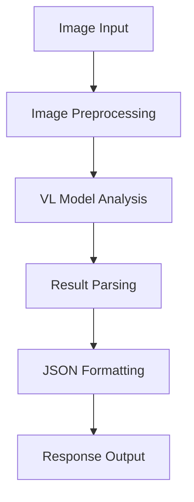

# Technical Learning Log

## 2024-12-14 Technical Learning Log

<div align="center">
  
  
  
  
</div>

## Core Issues Analysis 

### Main Technical Challenges 🎯
- **Image Comparison Functionality**: Need to develop a general-purpose image comparison and analysis feature
- **Vision Language Model Application**: Using Qwen-VL for image content understanding and comparison
- **JSON Formatting**: Processing non-standard JSON output from large language models
- **API Interface Design**: Implementing clear, user-friendly REST interfaces

### Problem Evolution Process 

1. **Initial Stage** 🚀
   - Attempted traditional image processing methods
   - Considered feature point matching and similar techniques
   
2. **Pivot to Large Model Solution** 🔄
   - Leveraging semantic understanding capabilities of vision language models
   - Controlling output through precise prompting

3. **Key Challenges** ⚠️
   - JSON parsing errors
   - Non-standardized model output formats
   - Code organization structure optimization

## Knowledge Expansion 

### Visual Analysis Technologies 🖼️
> In the field of image comparison, multiple technical approaches exist, each with their own advantages and disadvantages

#### Traditional Computer Vision Methods 🔍
  - SIFT feature matching
  - Pixel-level comparison
  - OpenCV toolchain
  
#### Vision Language Model Methods 🤖
  - Semantic-level understanding
  - High-level feature extraction
  - Natural language description

### FastAPI Application Development 
```python
# Route definition example
@app.post("/api/v2/compare-images")
async def compare_images_endpoint(
    files: List[UploadFile] = File(...),
    config: ImageComparisonConfig = None
)
```

#### Core Components ⚙️
  - Pydantic data models
  - Asynchronous processing
  - Dependency injection
  - Error handling middleware

### Data Processing and Validation 

#### JSON Processing Techniques 📝
  - Format cleaning
  - Error recovery
  - Type validation

#### Data Model Design 🏗️
```python
class ImageComparisonConfig(BaseModel):
    focus_elements: List[str]
    comparison_aspects: List[str]
    similarity_threshold: float
```

## Technical Deep Dive 

### Vision Language Model Application Architecture 🔄


### Error Handling Mechanisms 

#### Multi-layer Error Handling 🛡️
1. Input validation
2. Process exception capturing
3. Result formatting error handling
4. Unified API response handling

#### Error Recovery Strategies 🔧
```python
def sanitize_json_string(text: str) -> str:
    # Clean and normalize JSON string
    # 1. Extract JSON content
    # 2. Replace problematic characters
    # 3. Fix formatting issues
```

### Performance Optimization Considerations 

#### Image Processing Optimization 🖼️
  - Size limitations
  - Format conversion
  - Caching mechanisms

#### Concurrent Processing ⚡
  - Asynchronous operations
  - Batch processing mechanisms
  - Resource control

## Knowledge Map Construction 

### Core Technology Relationships 🔗

#### Visual Analysis 👁️
  - `VL Models` → Semantic Understanding → Feature Extraction
  - `OpenCV` → Image Processing → Feature Matching
  - `PIL` → Image Manipulation → Format Conversion

#### Web Development 💻
  - `FastAPI` → Asynchronous Processing → Route Management
  - `Pydantic` → Data Validation → Model Definition

### Best Practices Summary 

1. **Model Application** 🤖
   - Precise prompt design
   - Fault-tolerant result parsing
   - Appropriate configuration parameters

2. **Code Organization** 📦
   - Modular design
   - Clear separation of responsibilities
   - Comprehensive error handling

3. **Interface Design** 🔌
   - RESTful standards
   - Unified response format
   - Complete parameter validation

### Technical Evolution Directions 🚀
- Support for more image analysis scenarios
- Processing performance optimization
- Enhanced error handling capabilities
- More configuration options

## Implementation Examples 💻

### Enhanced Image Comparison Service
```python
from fastapi import FastAPI, File, UploadFile, HTTPException, Depends
from pydantic import BaseModel, Field
from typing import List, Dict, Any, Optional
import json
import re
import asyncio
from PIL import Image
import io
import logging

# Configure logging
logging.basicConfig(level=logging.INFO)
logger = logging.getLogger(__name__)

# Initialize FastAPI app
app = FastAPI(title="Image Comparison API")

# Data models
class ImageComparisonConfig(BaseModel):
    focus_elements: List[str] = Field(
        default=["color", "shape", "text", "layout"],
        description="Elements to focus on during comparison"
    )
    comparison_aspects: List[str] = Field(
        default=["visual similarity", "content similarity", "functional similarity"],
        description="Aspects to consider in the comparison"
    )
    similarity_threshold: float = Field(
        default=0.7,
        ge=0.0,
        le=1.0,
        description="Threshold for determining similarity (0.0-1.0)"
    )
    
    class Config:
        schema_extra = {
            "example": {
                "focus_elements": ["color", "text", "logo"],
                "comparison_aspects": ["visual similarity", "brand consistency"],
                "similarity_threshold": 0.8
            }
        }

class ComparisonResult(BaseModel):
    similarity_score: float
    differences: List[Dict[str, Any]]
    similarities: List[Dict[str, Any]]
    summary: str

# Helper functions
async def process_image(file: UploadFile) -> Image.Image:
    """Process uploaded image file into PIL Image"""
    try:
        contents = await file.read()
        image = Image.open(io.BytesIO(contents))
        return image
    except Exception as e:
        logger.error(f"Error processing image: {str(e)}")
        raise HTTPException(status_code=400, detail=f"Invalid image file: {str(e)}")

def sanitize_json_string(text: str) -> str:
    """Clean and normalize JSON string from model output"""
    # Extract JSON content (assuming it's wrapped in ```json ... ```)
    json_match = re.search(r'```(?:json)?(.*?)```', text, re.DOTALL)
    if json_match:
        text = json_match.group(1).strip()
    
    # Replace problematic characters
    text = text.replace('\n', ' ').replace('\t', ' ')
    
    # Fix common JSON formatting issues
    text = re.sub(r'(\w+):', r'"\1":', text)  # Add quotes to keys
    text = re.sub(r':\s*"([^"]*?)"\s*,', r': "\1",', text)  # Fix string values
    text = re.sub(r':\s*"([^"]*?)"\s*}', r': "\1"}', text)  # Fix last string value
    
    return text

async def compare_images_with_vl_model(
    image1: Image.Image, 
    image2: Image.Image, 
    config: ImageComparisonConfig
) -> Dict[str, Any]:
    """Compare two images using a Vision Language Model"""
    try:
        # Prepare prompt for the VL model
        prompt = f"""
        Compare these two images in detail, focusing on these elements: {', '.join(config.focus_elements)}.
        Consider these aspects in your comparison: {', '.join(config.comparison_aspects)}.
        
        Provide your analysis in the following JSON format:
        {{
            "similarity_score": (float between 0-1),
            "differences": [
                {{
                    "element": "element name",
                    "description": "detailed description of the difference"
                }}
            ],
            "similarities": [
                {{
                    "element": "element name",
                    "description": "detailed description of the similarity"
                }}
            ],
            "summary": "overall comparison summary"
        }}
        """
        
        # Here we would call the actual VL model API
        # For demonstration, we'll simulate a response
        
        # Simulated model response (in practice, this would come from the VL model)
        model_response = """```json
        {
            "similarity_score": 0.75,
            "differences": [
                {
                    "element": "color",
                    "description": "Image 1 has a predominantly blue color scheme while Image 2 uses more red tones"
                },
                {
                    "element": "text",
                    "description": "Different text content: Image 1 contains 'Product A' while Image 2 shows 'Product B'"
                }
            ],
            "similarities": [
                {
                    "element": "layout",
                    "description": "Both images use a similar layout with the main element centered"
                },
                {
                    "element": "logo",
                    "description": "The company logo appears in the top-right corner in both images"
                }
            ],
            "summary": "The images show different products from the same brand family, with consistent layout but different color schemes and product names."
        }```"""
        
        # Clean and parse the JSON response
        json_str = sanitize_json_string(model_response)
        result = json.loads(json_str)
        
        # Apply similarity threshold from config
        if result["similarity_score"] >= config.similarity_threshold:
            result["overall_assessment"] = "Images are considered similar based on the threshold"
        else:
            result["overall_assessment"] = "Images are considered different based on the threshold"
            
        return result
        
    except json.JSONDecodeError as e:
        logger.error(f"JSON parsing error: {str(e)}")
        raise HTTPException(status_code=500, detail=f"Error parsing model response: {str(e)}")
    except Exception as e:
        logger.error(f"Comparison error: {str(e)}")
        raise HTTPException(status_code=500, detail=f"Error during image comparison: {str(e)}")

# API endpoints
@app.post("/api/v2/compare-images", response_model=ComparisonResult)
async def compare_images_endpoint(
    files: List[UploadFile] = File(...),
    config: Optional[ImageComparisonConfig] = None
):
    """
    Compare two images and analyze their similarities and differences
    
    - Upload exactly two image files
    - Optionally provide a configuration object to customize the comparison
    """
    # Validate input
    if len(files) != 2:
        raise HTTPException(status_code=400, detail="Exactly two image files must be provided")
        
    # Use default config if none provided
    if config is None:
        config = ImageComparisonConfig()
    
    # Process images
    try:
        # Process images in parallel
        image1, image2 = await asyncio.gather(
            process_image(files[0]),
            process_image(files[1])
        )
        
        # Compare images
        result = await compare_images_with_vl_model(image1, image2, config)
        
        return ComparisonResult(
            similarity_score=result["similarity_score"],
            differences=result["differences"],
            similarities=result["similarities"],
            summary=result["summary"]
        )
        
    except Exception as e:
        logger.exception("Unexpected error in image comparison endpoint")
        raise HTTPException(status_code=500, detail=str(e))
```

### JSON Sanitization Utility
```python
def extract_and_clean_json(text: str) -> Dict[str, Any]:
    """
    Extract and clean JSON from model output text
    
    Args:
        text: Raw text output from the model
        
    Returns:
        Parsed JSON as a dictionary
        
    Raises:
        ValueError: If JSON cannot be extracted or parsed
    """
    # Try to find JSON block in markdown format
    json_match = re.search(r'```(?:json)?(.*?)```', text, re.DOTALL)
    if json_match:
        json_str = json_match.group(1).strip()
    else:
        # Try to find JSON between curly braces
        json_match = re.search(r'(\{.*\})', text, re.DOTALL)
        if json_match:
            json_str = json_match.group(1).strip()
        else:
            raise ValueError("No JSON content found in the response")
    
    # Clean up common issues
    # Replace single quotes with double quotes
    json_str = re.sub(r"'([^']*)':", r'"\1":', json_str)
    
    # Ensure property names are quoted
    json_str = re.sub(r'(\w+):', r'"\1":', json_str)
    
    # Fix trailing commas
    json_str = re.sub(r',\s*}', '}', json_str)
    json_str = re.sub(r',\s*]', ']', json_str)
    
    try:
        # Parse the cleaned JSON
        return json.loads(json_str)
    except json.JSONDecodeError as e:
        # If still failing, try a more aggressive approach
        try:
            # Use a JSON5 parser if available (more lenient)
            import json5
            return json5.loads(json_str)
        except (ImportError, Exception) as e2:
            raise ValueError(f"Failed to parse JSON: {str(e)}")
```

## Conclusion 📝

Today's technical exploration focused on developing an image comparison system using vision language models and FastAPI. The key insights include:

1. **Leveraging Vision Language Models**: Using advanced VL models like Qwen-VL provides semantic-level image comparison capabilities that go beyond traditional computer vision techniques
2. **Robust JSON Handling**: Implementing comprehensive JSON sanitization and error recovery mechanisms is essential when working with large language model outputs
3. **Modular API Design**: Creating a well-structured FastAPI application with clear separation of concerns improves maintainability and extensibility

These approaches enable the development of sophisticated image comparison services that can understand and articulate visual similarities and differences in natural language, while maintaining robust error handling and clean code organization. The system's architecture allows for future extensions to support additional comparison scenarios and integration with various vision language models. 