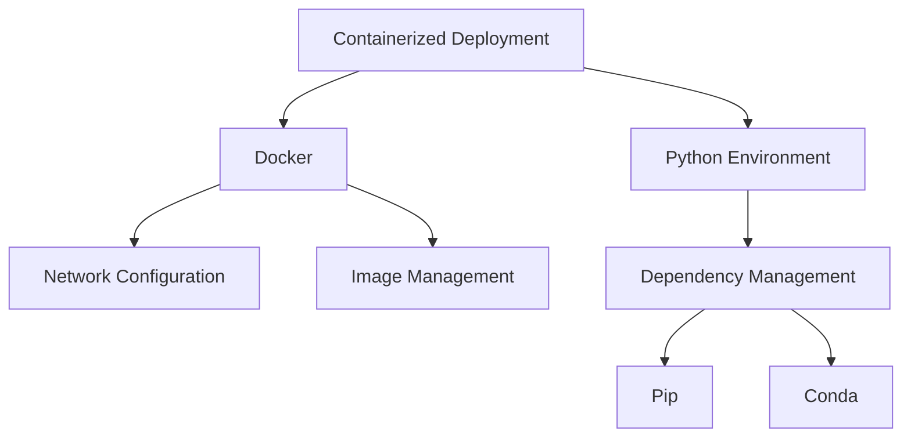

# Technical Learning Log: Python Environment Management and Docker Configuration Practice 📝

<div align="center">
  
  
  
  
</div>

## 2024-11-18 Technical Learning Log

### Core Issues Analysis 🎯

### Environment Configuration and Dependency Management ⚙️
#### Problem Background 📋
During the development environment setup process, we encountered a key decision point regarding the choice of dependency management tools. This primarily involved weighing the options between two mainstream tools: `Conda` and `Pip`.

#### Core Decision 🔍
> "Essentially, conda is an environment management tool that also functions as a package manager; while pip is purely a package management tool. This fundamental difference determines many of their characteristics."

**Key Considerations:** 💡
1. Complexity of environment management 🔄
2. Efficiency of the build process ⚡
3. Consistency of deployment environments 🔒
4. Control of maintenance costs 💰

### Docker Environment Configuration Optimization 🐳
#### Infrastructure Setup
```dockerfile
FROM python:3.9-slim

WORKDIR /app

# Configure apt sources
RUN echo \
    deb https://mirrors.tuna.tsinghua.edu.cn/debian/ bullseye main contrib non-free \
    > /etc/apt/sources.list

# System dependency installation
RUN apt-get update && apt-get install -y \
    git \
    poppler-utils \
    libgl1-mesa-glx \
    libglib2.0-0 \
    && rm -rf /var/lib/apt/lists/*
```

#### Network Configuration Optimization
```json
{
  "registry-mirrors": [
    "https://hub-mirror.c.163.com",
    "https://mirror.baidubce.com",
    "https://registry.docker-cn.com"
  ],
  "dns": [
    "8.8.8.8",
    "8.8.4.4"
  ],
  "max-concurrent-downloads": 3,
  "max-concurrent-uploads": 3,
  "mtu": 1400
}
```

### Knowledge Expansion 📚

#### Python Package Management Ecosystem 🌐
##### Historical Evolution 📅
1. **Early Stage**: `distutils` simple package distribution 🌱
2. **Development Stage**: `setuptools` providing more functionality 🚀
3. **Mature Stage**: `pip` becoming the standard package management tool 📦
4. **Environment Management**: Emergence of `virtualenv` and `conda` 🔄

##### Latest Trends 📈
- Rise and innovation of **Poetry**
- Widespread adoption of containerized deployment
- Improvements in dependency resolution algorithms
- Convergence of environment management tools

### Docker Technology Ecosystem
#### Core Concepts
- **Image Layering**: Optimizing storage and transfer efficiency
- **Container Isolation**: Ensuring consistency of application runtime environments
- **Network Management**: Flexible network configuration and optimization

#### Technical Evolution
1. From physical machines to virtual machines
2. From virtual machines to containers
3. From single-machine containers to container orchestration
4. From manual deployment to automated CI/CD

### Technical Deep Dive 🔬

#### Docker Network Configuration Analysis 🌐
#### Network Models
1. Bridge Network: Inter-container communication
2. Host Network: Direct use of host network
3. None Network: Complete isolation
4. Overlay Network: Cross-host communication

#### Performance Optimization
- MTU setting optimization
- DNS configuration optimization
- Image source selection
- Concurrency control

### Python Environment Management Practices
#### Version Control Strategy
```python
# requirements.txt
fastapi>=0.68.0
uvicorn>=0.15.0
python-multipart>=0.0.5
pillow>=8.3.1
pdf2image>=1.16.0
python-magic>=0.4.24
loguru>=0.5.3
pydantic<2.0.0  # Version locking example
```

#### Dependency Management Best Practices
1. Clear version control
2. Grouped dependency management
3. Environment isolation strategy
4. Regular updates and maintenance

### Knowledge Map Construction 🗺️

#### Technology Stack Relationships 📊


#### Learning Path Recommendations 📈
1. **Basic Knowledge Foundation** 🌱
   - Docker fundamentals
   - Python package management basics
   - Linux system basics

2. **Advanced Skill Development** 🚀
   - Docker best practices
   - Network configuration optimization
   - Automated deployment

3. **Expert-Level Skills** 🎯
   - Container orchestration
   - Microservice architecture
   - DevOps practices

### Technology Selection Recommendations
> "When choosing a technology stack, you need to consider multiple factors such as team technical expertise, project scale, maintenance costs, etc. There is no best choice, only the most suitable choice."

#### Evaluation Dimensions
1. Technology maturity
2. Community activity
3. Learning curve
4. Maintenance cost
5. Ecosystem

### Practical Insights 💡

#### Environment Configuration Principles ⚙️
1. **Simplicity**: Avoid unnecessary complexity 🎯
2. **Maintainability**: Focus on long-term maintenance costs 🔧
3. **Scalability**: Reserve space for future expansion 🚀

#### Troubleshooting Methods 🔍
1. **Systematic Analysis**: From symptoms to root causes
2. **Layer-by-Layer Diagnosis**: From shallow to deep
3. **Complete Documentation**: Document problems and solutions

#### Continuous Optimization Suggestions
1. **Performance Monitoring**: Establish monitoring mechanisms
2. **Regular Reviews**: Check configuration rationality
3. **Timely Updates**: Keep up with technological developments

### Reference Resources 📚

#### Official Documentation 📖
- [Docker Documentation](https://docs.docker.com/)
- [Python Packaging Guide](https://packaging.python.org/)
- [FastAPI Documentation](https://fastapi.tiangolo.com/)

#### Technical Communities
- Docker Hub
- PyPI
- GitHub Discussions

#### Learning Materials
- Docker Best Practices Guide
- Python Dependency Management In-Depth Analysis
- Containerized Deployment Practical Guide 