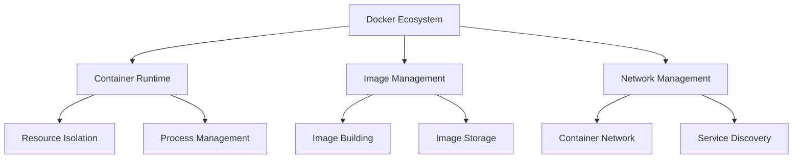

# Docker Environment Configuration and Best Practices 📝

<div align="center">
  
  
  
  
</div>

## 2024-11-19 Technical Learning Log

### Core Issues Analysis 🎯

In today's technical exploration, we focused on solving the following core issues:

#### 1. Docker Environment Configuration Issues 🐳

Docker environment configuration is a complex system engineering task involving multiple technical layers:

1. Basic Environment Setup 🏗️
- **Hardware Environment**: MacBook Pro (M3 chip) 💻
- **System Requirements**: Operating system supporting containerization ⚙️
- **Network Environment**: Need to configure domestic image registries 🌐

2. Key Configuration Steps ⚡
```json
{
  "registry-mirrors": [
    "https://mirror.baidubce.com",
    "https://hub-mirror.c.163.com",
    "https://mirror.ccs.tencentyun.com"
  ]
}
```

> Important Note: In the Chinese environment, properly configuring image registries is a key factor in improving build efficiency.

#### 2. Dependency Management Optimization 📦

Dependency management is a critical factor for project success:

1. Problem Description ⚠️
- Cross-platform dependency conflicts 🔄
- Windows-specific package compatibility in Linux environments 🖥️
- Python package version management 🐍

2. Solution 💡
```dockerfile
# Preprocess requirements.txt
RUN sed -i '/pywin32/d' requirements.txt

# Set pip mirror source
RUN pip config set global.index-url https://mirrors.huaweicloud.com/repository/pypi/simple/

# Install dependencies
RUN pip install --no-cache-dir -r requirements.txt
```

### Knowledge Expansion 📚

#### 1. Docker Technology Ecosystem 🌐

The Docker technology ecosystem includes several important components:

1. Core Components ⚙️
- **Docker Engine**: Core container runtime 🚀
- **Docker Compose**: Multi-container application management 🔄
- **Container Registry**: Image repository service 📦
- **Docker Network**: Container network management 🌐

2. Extension Tools 🛠️
- Monitoring tools
- Log management
- Security scanning
- Development tool integration

#### 2. Best Practices and Experience

In actual development, we summarized the following best practices:

1. Image Build Optimization
```dockerfile
# Use multi-stage builds
FROM python:3.10 AS builder
WORKDIR /app
COPY requirements.txt .
RUN pip install --user -r requirements.txt

FROM python:3.10-slim
COPY --from=builder /root/.local /root/.local
WORKDIR /app
```

2. Network Access Optimization
- Use domestic image registries
- Implement request retry mechanisms
- Configure reasonable timeout periods

### Technical Deep Dive 🔬

#### 1. Docker Architecture Principles 🏗️

Docker's core architecture includes the following components:

1. Client-Server Architecture 🖥️
- **Docker Client**: Command-line interface
- **Docker Daemon**: Manages containers and images
- **Registry**: Image repository service

2. Image Layer Structure
- Base image layer
- Intermediate layers
- Writable container layer

#### 2. Performance Optimization Strategies

To improve system performance, we implemented the following optimizations:

1. Build Optimization
```dockerfile
# Optimize build cache
COPY requirements.txt .
RUN pip install -r requirements.txt
COPY . .
```

2. Runtime Optimization
- Properly configure resource limits
- Optimize log handling
- Implement health checks

### Knowledge Map Construction 🗺️

#### 1. Technology Stack Relationship Diagram 📊



#### 2. Learning Path Recommendations 📈

1. Basic Stage 🌱
- Docker basic concepts
- Container lifecycle
- Basic command usage

2. Intermediate Stage
- Network configuration
- Storage management
- Performance optimization

3. Advanced Stage
- Microservice architecture
- Service orchestration
- Monitoring and alerting

#### 3. Technology Evolution Directions

1. Container Technology Development
- Virtualization technology
- Container standards
- Cloud-native architecture

2. Toolchain Evolution
- CI/CD integration
- Automated deployment
- Intelligent operations

### Summary and Outlook 🎯

#### 1. Core Achievements ✨

1. Technical Accumulation 📚
- Docker environment configuration experience
- Problem troubleshooting methodology
- Performance optimization techniques

2. Best Practices
- Dependency management strategies
- Build process optimization
- Network access optimization

#### 2. Future Plans 🚀

1. Technical Improvement 📈
- In-depth learning of container orchestration
- Exploring cloud-native architecture
- Enhancing operational capabilities

2. Practical Goals
- Optimize build processes
- Improve monitoring systems
- Increase system reliability

> Note: Technical learning is an ongoing process that requires continuous practice and summarization.

This technical log records important discoveries and experience summaries in the Docker environment configuration process. Through systematic organization and analysis, we not only solved current technical issues but also laid the foundation for future technical development. 