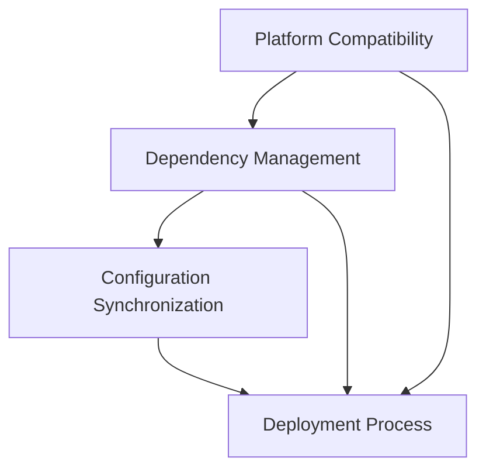
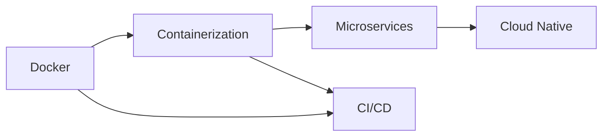

# Technical Learning Log: Docker Containerization Deployment Practice 📝

## 2024-11-21 Technical Learning Log

<div align="center">
  
  
  
  
</div>

## Core Issues Analysis 🎯

### 1. Key Challenges 📋
- **Platform Compatibility Issues** 💻: Docker adaptation for ARM64 architecture on M1/M2 Mac
- **Dependency Management Challenges** 📦: Cross-platform dependency handling for Python applications
- **Configuration Synchronization** 🔄: Maintaining configuration consistency between development and production environments
- **Deployment Process Optimization** 🚀: Establishing containerization deployment best practices

### 2. Problem Correlation Analysis 🔍
These issues form a complete technical chain:


> **Key Finding**: Platform compatibility issues form the foundation for other problems. Properly addressing platform issues ensures smooth execution of subsequent steps.

## Knowledge Expansion 📚

### 1. Container Technology Ecosystem 🌐
- **Docker Development Timeline** 📅
  - 2013: Initial Docker release
  - 2015: Docker Compose introduction
  - 2017: Moby Project launch
  - 2020: Docker Desktop for Apple Silicon preview
  
- **Modern Container Technology Stack** ⚡
  - Container Runtimes: Docker, containerd
  - Orchestration Platforms: Kubernetes, Docker Swarm
  - Image Registries: Docker Hub, Harbor
  - Build Tools: Dockerfile, Buildah

### 2. Python Dependency Management Evolution 📦
- **Traditional Solutions** 🔧:
  - requirements.txt
  - setup.py
- **Modern Tools** 🛠️:
  - Poetry
  - Pipenv
  - PDM

> "The complexity of dependency management is often underestimated, yet it's a critical factor in building reliable production systems."

### 3. Cross-Platform Deployment Trends 🌍
- **Rise of ARM Architecture** 🚀
  - Impact of Apple Silicon
  - Server-side ARM applications
  - Balance between performance and efficiency

## Technical Deep Dive 🔬

### 1. Docker Platform Compatibility Principles 💻
```dockerfile
# Importance of platform declaration
FROM --platform=linux/arm64 python:3.10
```

**Key Concept Analysis** 🔑:
- The `--platform` flag informs the Docker build system of the target architecture
- Multi-architecture image principles
- Architecture adaptation during image building process

### 2. Python Dependency Management Best Practices ⚙️
```python
# Dependency layering example
requirements/
    base.txt      # Base dependencies
    production.txt # Production environment dependencies
    development.txt # Development environment dependencies
```

**Practical Recommendations** 💡:
- Use virtual environments for isolation
- Implement explicit version locking
- Manage dependencies in layers
- Utilize dependency hash verification

### 3. Containerized Deployment Optimization 🚀
**Multi-stage Build Example**:
```dockerfile
# Build stage
FROM python:3.10 AS builder
WORKDIR /build
COPY requirements.txt .
RUN pip wheel --no-cache-dir --no-deps -r requirements.txt

# Runtime stage
FROM python:3.10-slim
COPY --from=builder /build /wheels
RUN pip install /wheels/*
```

## Knowledge Map Construction 🗺️

### 1. Technology Stack Relationships 🔗


### 2. Learning Path Recommendations 📈

#### Foundational Stage 🌱
1. **Container Basics**
   - Docker core concepts
   - Dockerfile writing
   - Container lifecycle management

2. **Python Application Containerization**
   - Dependency management
   - Environment configuration
   - Development workflow

#### Advanced Stage 🚀
1. **Best Practices**
   - Multi-stage builds
   - Image optimization
   - Security hardening

2. **Production Deployment**
   - Monitoring solutions
   - Log management
   - Performance optimization

### 3. Technology Selection Recommendations 🛠️

#### Development Environment 💻
- **IDE**: VS Code + Docker plugin
- **Dependency Management**: Poetry/Pipenv
- **Debugging Tools**: Docker Desktop

#### Production Environment ⚙️
- **Container Orchestration**: Kubernetes/Docker Swarm
- **Monitoring Solution**: Prometheus + Grafana
- **Log Management**: ELK Stack

## Practical Summary 💡

### 1. Key Experiences 🔑
> "In Docker environments, configuration consistency and reproducibility are more important than development convenience."

### 2. Common Pitfalls ⚠️
- Neglecting platform compatibility issues
- Improper dependency management
- Insufficient configuration separation
- Inadequate image optimization

### 3. Improvement Suggestions 📈
1. **Toolchain Optimization**
   - Use Docker Compose for service management
   - Implement build cache mechanisms
   - Deploy automated testing

2. **Process Standardization**
   - Establish build specifications
   - Improve documentation systems
   - Optimize deployment workflows

## Advanced Learning Directions 🎯

1. **Container Orchestration** 🎮
   - Kubernetes fundamentals
   - Service mesh
   - Cloud-native architecture

2. **DevOps Practices** ⚡
   - CI/CD pipelines
   - Automated testing
   - Monitoring and alerting

3. **Performance Optimization** 🚀
   - Image minimization
   - Startup optimization
   - Resource utilization

4. **Security Hardening** 🔒
   - Vulnerability scanning
   - Principle of least privilege
   - Security baselines

> "Technical learning is an iterative process; solving each problem opens new learning domains." 💭 