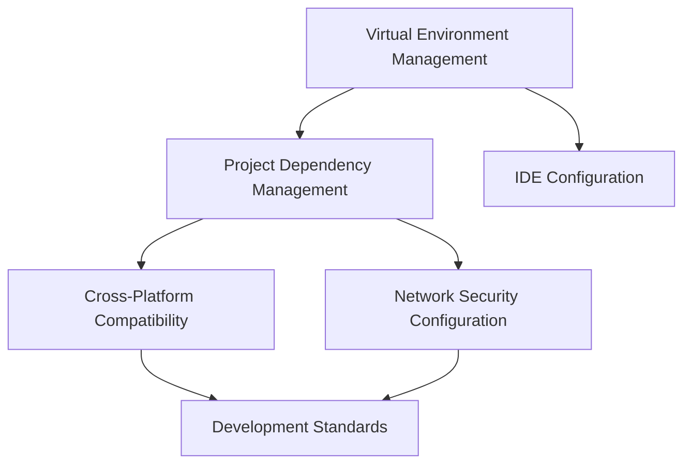

# Technical Learning Log: Python Virtual Environments and Development Environment Configuration 📝

## 2024-11-22 Technical Learning Log

<div align="center">
  
  
  
  
</div>

## Core Issues Analysis 🎯

### Main Problem Areas 🔍

Today's technical exploration primarily revolves around **Python virtual environment configuration**, forming a complete chain from creation to problem-solving:

1. **Virtual Environment Management** 🌱
   - **Issue**: How to create and manage Python virtual environments in VSCode?
   - **Solution**: Use the `python3 -m venv` command to create, and `source .venv/bin/activate` to activate
   - **Relation**: Closely connected to IDE integration and project dependency management

2. **Multiple Environment Coexistence** 🔄
   - **Issue**: How to handle multiple virtual environments displayed in VSCode?
   - **Solution**: Clean up redundant environments, maintain a single virtual environment
   - **Relation**: Involves development environment standardization and project configuration management

3. **Cross-Platform Compatibility** 💻
   - **Issue**: Handling Windows-specific packages in Mac environments
   - **Solution**: Remove platform-specific dependencies, adjust requirements.txt
   - **Relation**: Related to Python package management and cross-platform development practices

4. **Network and Security Issues** 🔒
   - **Issue**: SSL certificate verification failures
   - **Solution**: Use mirror sources and trusted host configurations
   - **Relation**: Involves Python package management security and network configuration

### Problem Correlation Analysis

These issues form an interconnected technical ecosystem:


## Knowledge Expansion 📚

### Python Virtual Environment Technology Ecosystem 🌐

1. **Historical Development** 📅
   - Early Python: Global environment management
   - Introduction of virtualenv: Independent environment concept
   - venv module: Built-in virtual environment support in Python 3.3+
   - Modern tools: Poetry, Pipenv, and other next-generation package management tools

2. **Latest Technology Trends** 🚀
   - Containerized virtual environment management
   - Dependency resolution algorithm optimization
   - Development environment standardization
   - Enhanced IDE integration

3. **Application Scenario Analysis** 🔍
   - Project isolation development
   - Dependency version management
   - Deployment environment consistency
   - Team collaboration standardization

## Technical Deep Dive 🔬

### 1. Virtual Environment Principles Analysis

Virtual environments essentially create independent Python interpreter environments, achieving package isolation by modifying system paths:

```python
# Core logic of virtual environment activation script
import os
import site

# Modify sys.path
base = os.path.dirname(os.path.dirname(os.path.abspath(__file__)))
os.environ["VIRTUAL_ENV"] = base

# Modify PATH environment variable
bin_dir = os.path.join(base, "bin")
os.environ["PATH"] = bin_dir + os.pathsep + os.environ["PATH"]
```

### 2. Best Practices Guide

1. **Virtual Environment Management**
   ```bash
   # Create virtual environment
   python3 -m venv .venv
   
   # Activate environment
   source .venv/bin/activate
   
   # Dependency management
   pip install -r requirements.txt
   ```

2. **Dependency File Management**
   ```txt
   # requirements.txt best practices
   package_name==version  # Fixed version
   package_name>=version  # Minimum version requirement
   package_name~=version  # Compatible version
   ```

### 3. Common Problem Solutions

1. **SSL Certificate Issues**
   ```bash
   # Using mirror sources
   pip install -r requirements.txt -i https://pypi.tuna.tsinghua.edu.cn/simple
   
   # Trust configuration
   --trusted-host pypi.tuna.tsinghua.edu.cn
   ```

2. **Cross-Platform Compatibility**
   ```python
   # Conditional dependency example
   requirements = [
       'base_package',
       'pywin32==308; platform_system=="Windows"'
   ]
   ```

## Knowledge Map Construction 🗺️

### Technology Stack Relationships 🔗

1. **Core Technology Stack** ⚡
   - Python interpreter
   - Package management tools (pip)
   - Virtual environments (venv)
   - IDE integration (VSCode)

2. **Extended Technology Stack** 🛠️
   - Container technology (Docker)
   - CI/CD tools
   - Code quality tools
   - Dependency checking tools

### Learning Path Recommendations 📈

1. **Foundation Stage** 🌱
   - Python basic syntax
   - Package management fundamentals
   - Virtual environment concepts

2. **Intermediate Stage** 🚀
   - Dependency management best practices
   - Development environment configuration
   - Cross-platform development considerations

3. **Advanced Stage** 🎓
   - Automated environment configuration
   - Containerized development environments
   - Team best practices establishment

### Advanced Directions 🎯

1. **Engineering Direction** ⚙️
   - Automated environment configuration
   - Development environment standardization
   - CI/CD integration

2. **Architecture Direction** 🏗️
   - Microservice architecture
   - Containerized deployment
   - Cloud-native development

3. **Toolchain Direction** 🛠️
   - Automated tool development
   - IDE plugin development
   - Development efficiency tools

## Experience Summary 💡

Through this practice, we gained a deeper understanding of the importance and complexity of Python virtual environments. Key experiences include:

1. **Importance of Environment Isolation** 🔒
   > Virtual environments are not just development tools, but critical infrastructure for project management

2. **Necessity of Standardization** 📋
   > Establishing and following standardized environment configuration processes can significantly reduce team collaboration costs

3. **Problem-Solving Approach** 🔍
   > When encountering issues, systematically analyze from multiple perspectives including environment, dependencies, and platform compatibility

## Future Planning 🎯

1. **Technical Improvement** 📚
   - Deep dive into Python package management mechanisms
   - Research automated environment configuration solutions
   - Explore containerized development environments

2. **Engineering Practice** ⚙️
   - Establish team development environment standards
   - Refine dependency management processes
   - Optimize development toolchain

3. **Knowledge Sharing** 📢
   - Write environment configuration guides
   - Compile common problem solutions
   - Share best practice experiences 