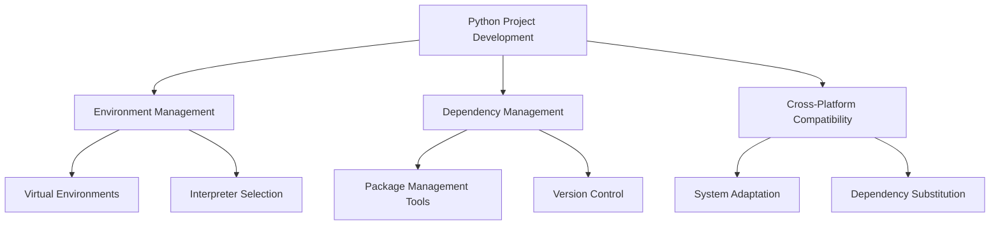

# Technical Learning Log 📝

## 2024-11-25 Technical Learning Log

<div align="center">
  
  
  
  
</div>

## Core Issues Analysis 🎯

### 1. Python Cross-Platform Development Adaptation Issues 🔄
**Problem Description** ⚠️: System compatibility issues encountered when deploying a Windows-developed Python project (langchain-chatchat) on a Mac system
**Core Solutions** 💡:
- Identify and remove Windows-specific dependencies (such as `pywin32`) 📦
- Create platform-specific dependency files (requirements_mac.txt) 📄
- Use cross-platform compatible dependency alternatives 🔄

> The key to cross-platform development is identifying system-specific dependencies and finding suitable alternatives or graceful degradation strategies. 💭

### 2. SSL Certificate Verification Issues 🔒
**Problem Description** ⚠️: SSL certificate verification failures encountered during package installation
**Core Solutions** 💡:
- Update certificate libraries (certifi) 🔑
- Use trusted mirror sources 🌐
- Configure trusted host options ⚙️

> SSL certificate issues are common in network-restricted environments or with improper certificate configurations, requiring a balance between security and usability. ⚖️

### 3. Python Package Management and Dependency Resolution 📦
**Problem Description** ⚠️: Project dependency installation and version compatibility issues
**Core Solutions** 💡:
- Use virtual environments to isolate dependencies 🌱
- Utilize domestic mirror sources to accelerate downloads 🚀
- Handle dependency conflicts and version constraints 🔧

## Knowledge Expansion 📚

### Python Ecosystem 🌐
1. **Package Management Tool Evolution** 📈
   - Development history of pip 🔄
   - Modern package management tools (poetry, pipenv) 🛠️
   - Virtual environment tools (venv, virtualenv) 🌱

2. **Cross-Platform Development Best Practices** ✨
   - System-specific code handling strategies 💻
   - Conditional imports and platform detection 🔍
   - Platform differences in dependency management ⚖️

3. **Security Considerations** 🛡️
   - SSL/TLS applications in Python 🔒
   - Certificate verification mechanisms ✅
   - Secure dependency management 🔐

## Technical Deep Dive 🔬

### Python Virtual Environment Principles 🧪
```python
# Virtual environment creation process 🌱
python -m venv .venv
source .venv/bin/activate  # Unix
.venv\Scripts\activate.bat # Windows
```

Virtual environments achieve project-level dependency isolation by creating independent copies of the Python interpreter and package directories. This isolation mechanism ensures:
- Different projects can use different package versions 📦
- Avoidance of global package pollution 🛡️
- Ease of project migration and deployment 🚀

### Dependency Management Best Practices ⚙️
1. **Clear Dependency Specifications** 📋
```python
# requirements.txt best practices 📝
package_name==specific_version  # Exact version
package_name>=minimum_version  # Minimum version requirement
package_name>=min,<max  # Version range
```

2. **Dependency Resolution Strategies** 🎯
- Use `pip-tools` to generate deterministic dependencies 🛠️
- Adopt layered dependency file organization 📑
- Implement reproducible build environments 🔄

## Knowledge Map Construction 🗺️

### Core Technology Relationships 🔗


### Learning Path Recommendations 📈
1. **Foundation Stage** 🌱
   - Python basic syntax 📖
   - Package management fundamentals 📦
   - Virtual environment usage 🔧

2. **Intermediate Stage** 🚀
   - In-depth dependency management tools 🛠️
   - Cross-platform development techniques 💻
   - Security best practices 🔒

3. **Expert Stage** 🎓
   - Build tool development ⚙️
   - CI/CD integration 🔄
   - Large-scale project management 📊

### Advanced Learning Suggestions 📚
- Study Python packaging specifications (PEPs) 📋
- Understand different operating system characteristics 💻
- Master automated build tools 🛠️
- Learn containerization technologies 🐳

## Practical Guidelines 💡

1. **Environment Configuration Checklist** ⚙️
```bash
# Basic environment setup 🌱
python -m venv .venv
source .venv/bin/activate
pip install --upgrade pip setuptools wheel

# Dependency installation 📦
pip install -r requirements.txt --trusted-host pypi.org --trusted-host files.pythonhosted.org -i https://pypi.tuna.tsinghua.edu.cn/simple
```

2. **Troubleshooting Process** 🔍
- Check environment variables ⚙️
- Verify Python version 🐍
- Confirm system dependencies 📦
- Check network connections 🌐
- Analyze error logs 📋

3. **Maintenance Recommendations** 🛠️
- Regularly update dependencies 🔄
- Keep documentation synchronized 📚
- Perform compatibility testing ✅
- Monitor security alerts ⚠️

## Technology Trends and Outlook 🔮

1. **Package Management Tool Development** 📈
- Smarter dependency resolution 🧠
- Better cross-platform support 🌐
- Integrated security audit features 🛡️

2. **Development Toolchain Evolution** ⚡
- Automated dependency updates 🔄
- Intelligent problem diagnostics 🔍
- Cross-platform development assistance 💻

3. **Best Practice Trends** 🎯
- "Zero configuration" toolchains ⚙️
- Stricter dependency locking 🔒
- More comprehensive security mechanisms 🛡️

## Summary and Reflection 📝

Today's technical practice involved cross-platform migration and environment configuration for Python projects, primarily addressing system compatibility, certificate verification, and dependency management issues. These problems reflect common challenges in modern software development, requiring trade-offs in technology selection and implementation approaches.

Through this practice, we not only solved specific problems but also gained a deeper understanding of several important concepts in the Python ecosystem. These experiences provide valuable reference for building reliable, maintainable Python projects. ✨ 