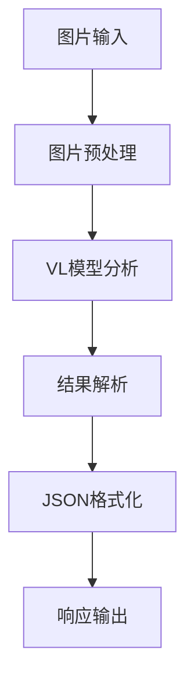

# 视觉大模型与图像对比系统开发实践

<div align="center">
  
  
  
  
</div>

## 核心问题梳理 

### 主要技术挑战 🎯
- **图片对比功能实现**：需要开发一个通用的图片对比分析功能
- **视觉大模型应用**：使用 Qwen-VL 进行图片内容理解和对比
- **JSON格式化处理**：处理大模型输出的非标准JSON格式
- **API接口设计**：实现清晰、易用的REST接口

### 问题演进过程 

1. **初始阶段** 🚀
   - 尝试使用传统图像处理方法
   - 考虑特征点匹配等技术
   
2. **转向大模型方案** 🔄
   - 利用视觉大模型的语义理解能力
   - 通过精确的prompt控制输出

3. **遇到的难点** ⚠️
   - JSON解析错误
   - 模型输出格式不规范
   - 代码组织结构优化

## 知识点拓展 

### 视觉分析技术 🖼️
> 在图像对比领域，存在多种技术路线，各有优劣

#### 传统计算机视觉方法 🔍
  - SIFT特征匹配
  - 像素级对比
  - OpenCV工具链
  
#### 视觉大模型方法 🤖
  - 语义级理解
  - 高级特征提取
  - 自然语言描述

### FastAPI应用开发 
```python
# 路由定义示例
@app.post("/api/v2/compare-images")
async def compare_images_endpoint(
    files: List[UploadFile] = File(...),
    config: ImageComparisonConfig = None
)
```

#### 核心组件 ⚙️
  - Pydantic数据模型
  - 异步处理
  - 依赖注入
  - 错误处理中间件

### 数据处理与验证 

#### JSON处理技巧 📝
  - 格式化清理
  - 错误恢复
  - 类型验证

#### 数据模型设计 🏗️
```python
class ImageComparisonConfig(BaseModel):
    focus_elements: List[str]
    comparison_aspects: List[str]
    similarity_threshold: float
```

## 技术深度解析 

### 视觉大模型应用架构 🔄


### 错误处理机制 

#### 多层错误处理 🛡️
1. 输入验证
2. 处理过程异常捕获
3. 结果格式化错误处理
4. API响应统一处理

#### 错误恢复策略 🔧
```python
def sanitize_json_string(text: str) -> str:
    # 清理和规范化JSON字符串
    # 1. 提取JSON内容
    # 2. 替换问题字符
    # 3. 修复格式问题
```

### 性能优化考虑 

#### 图片处理优化 🖼️
  - 大小限制
  - 格式转换
  - 缓存机制

#### 并发处理 ⚡
  - 异步操作
  - 批处理机制
  - 资源控制

## 知识图谱构建 

### 核心技术关联 🔗

#### 视觉分析 👁️
  - `VL模型` → 语义理解 → 特征提取
  - `OpenCV` → 图像处理 → 特征匹配
  - `PIL` → 图像操作 → 格式转换

#### Web开发 💻
  - `FastAPI` → 异步处理 → 路由管理
  - `Pydantic` → 数据验证 → 模型定义

### 最佳实践总结 

1. **模型应用** 🤖
   - 精确的prompt设计
   - 结果解析的容错处理
   - 合理的配置参数

2. **代码组织** 📦
   - 模块化设计
   - 清晰的职责划分
   - 完善的错误处理

3. **接口设计** 🔌
   - RESTful规范
   - 统一的响应格式
   - 完整的参数验证

### 技术演进方向 🚀
- 支持更多图像分析场景
- 优化处理性能
- 增强错误处理能力
- 提供更多配置选项
