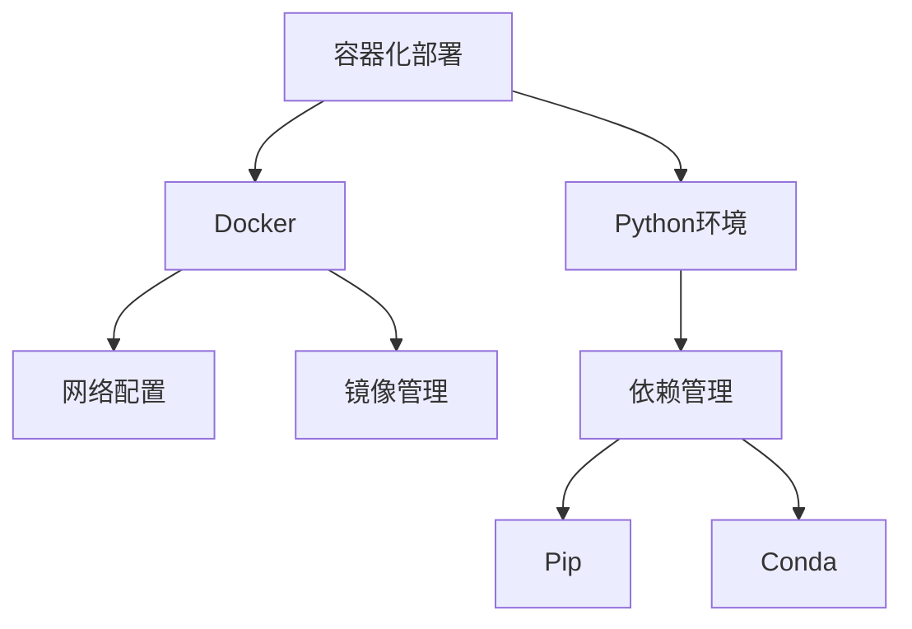

# 技术学习日志：Python环境管理与Docker配置实践 📝

<div align="center">
  
  
  
  
</div>

## 2024-03-12 技术学习日志

### 核心问题梳理 🎯

### 环境配置与依赖管理 ⚙️
#### 问题背景 📋
在开发环境搭建过程中，我们遇到了关于依赖管理工具选择的关键决策点。主要涉及 `Conda` 和 `Pip` 两个主流工具的选择与权衡。

#### 核心决策 🔍
> "从本质上说，conda是一个环境管理工具，同时也是包管理工具；而pip纯粹是一个包管理工具。这个根本区别决定了它们的很多特性。"

**关键考量点：** 💡
1. 环境管理的复杂度 🔄
2. 构建过程的效率 ⚡
3. 部署环境的一致性 🔒
4. 维护成本的控制 💰

### Docker环境配置优化 🐳
#### 基础设施搭建
```dockerfile
FROM python:3.9-slim

WORKDIR /app

# 配置apt源
RUN echo \
    deb https://mirrors.tuna.tsinghua.edu.cn/debian/ bullseye main contrib non-free \
    > /etc/apt/sources.list

# 系统依赖安装
RUN apt-get update && apt-get install -y \
    git \
    poppler-utils \
    libgl1-mesa-glx \
    libglib2.0-0 \
    && rm -rf /var/lib/apt/lists/*
```

#### 网络配置优化
```json
{
  "registry-mirrors": [
    "https://hub-mirror.c.163.com",
    "https://mirror.baidubce.com",
    "https://registry.docker-cn.com"
  ],
  "dns": [
    "8.8.8.8",
    "8.8.4.4"
  ],
  "max-concurrent-downloads": 3,
  "max-concurrent-uploads": 3,
  "mtu": 1400
}
```

### 知识点拓展 📚

#### Python包管理生态 🌐
##### 历史演进 📅
1. **早期阶段**：`distutils` 简单包分发 🌱
2. **发展阶段**：`setuptools` 提供更多功能 🚀
3. **成熟阶段**：`pip` 成为标准包管理工具 📦
4. **环境管理**：`virtualenv` 和 `conda` 的出现 🔄

##### 最新趋势 📈
- **Poetry** 的兴起与创新
- 容器化部署的普及
- 依赖解析算法的改进
- 环境管理工具的融合

### Docker技术生态
#### 核心概念
- **镜像分层**：优化存储和传输效率
- **容器隔离**：确保应用运行环境的一致性
- **网络管理**：灵活的网络配置和优化

#### 技术演进
1. 从物理机到虚拟机
2. 从虚拟机到容器
3. 从单机容器到容器编排
4. 从手动部署到自动化CI/CD

### 技术深度解析 🔬

#### Docker网络配置剖析 🌐
#### 网络模型
1. Bridge网络：容器间通信
2. Host网络：直接使用主机网络
3. None网络：完全隔离
4. Overlay网络：跨主机通信

#### 性能优化
- MTU设置优化
- DNS配置优化
- 镜像源选择
- 并发控制

### Python环境管理实践
#### 版本控制策略
```python
# requirements.txt
fastapi>=0.68.0
uvicorn>=0.15.0
python-multipart>=0.0.5
pillow>=8.3.1
pdf2image>=1.16.0
python-magic>=0.4.24
loguru>=0.5.3
pydantic<2.0.0  # 版本锁定示例
```

#### 依赖管理最佳实践
1. 明确的版本控制
2. 分组管理依赖
3. 环境隔离策略
4. 定期更新维护

### 知识图谱构建 🗺️

#### 技术栈关联 📊


#### 学习路径建议 📈
1. **基础知识储备** 🌱
   - Docker基础概念
   - Python包管理基础
   - Linux系统基础

2. **进阶技能培养** 🚀
   - Docker最佳实践
   - 网络配置优化
   - 自动化部署

3. **专家级技能** 🎯
   - 容器编排
   - 微服务架构
   - DevOps实践

### 技术选型建议
> "选择技术栈时需要考虑团队技术储备、项目规模、维护成本等多个因素，没有最好的选择，只有最适合的选择。"

#### 评估维度
1. 技术成熟度
2. 社区活跃度
3. 学习曲线
4. 维护成本
5. 生态系统

### 实践启示 💡

#### 环境配置原则 ⚙️
1. **简单性**：避免不必要的复杂性 🎯
2. **可维护性**：注重长期维护成本 🔧
3. **可扩展性**：预留未来扩展空间 🚀

#### 问题排查方法 🔍
1. **系统化分析**：从表象到本质
2. **逐层诊断**：由浅入深
3. **完整记录**：文档化问题和解决方案

#### 持续优化建议
1. **性能监控**：建立监控机制
2. **定期评审**：检查配置的合理性
3. **及时更新**：跟进技术发展

### 参考资源 📚

#### 官方文档 📖
- [Docker Documentation](https://docs.docker.com/)
- [Python Packaging Guide](https://packaging.python.org/)
- [FastAPI Documentation](https://fastapi.tiangolo.com/)

#### 技术社区
- Docker Hub
- PyPI
- GitHub Discussions

#### 学习资料
- Docker最佳实践指南
- Python依赖管理深度解析
- 容器化部署实战指南

