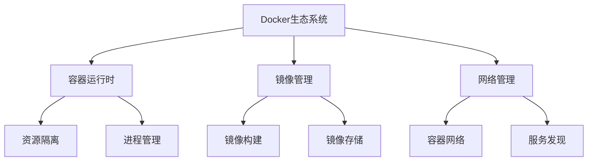

# 技术学习日志：Docker环境配置与最佳实践

## 2024-03-12 技术学习日志

### 核心问题梳理

在今天的技术探索中，我们着重解决了以下核心问题：

#### 1. Docker环境配置问题

Docker环境配置是一个复杂的系统工程，涉及多个技术层面：

1. 基础环境搭建
- **硬件环境**：MacBook Pro (M3芯片)
- **系统要求**：支持容器化的操作系统
- **网络环境**：需要配置国内镜像源

2. 关键配置步骤
```json
{
  "registry-mirrors": [
    "https://mirror.baidubce.com",
    "https://hub-mirror.c.163.com",
    "https://mirror.ccs.tencentyun.com"
  ]
}
```

> 重要提示：在中国环境下，合理配置镜像源是提升构建效率的关键因素。

#### 2. 依赖管理优化

依赖管理是项目成功的关键因素：

1. 问题描述
- 跨平台依赖冲突
- Windows特定包在Linux环境的兼容性
- Python包版本管理

2. 解决方案
```dockerfile
# 预处理requirements.txt
RUN sed -i '/pywin32/d' requirements.txt

# 设置pip镜像源
RUN pip config set global.index-url https://mirrors.huaweicloud.com/repository/pypi/simple/

# 安装依赖
RUN pip install --no-cache-dir -r requirements.txt
```

### 知识点拓展

#### 1. Docker技术生态

Docker技术生态系统包含多个重要组件：

1. 核心组件
- **Docker Engine**: 容器运行时核心
- **Docker Compose**: 多容器应用管理
- **Container Registry**: 镜像仓库服务
- **Docker Network**: 容器网络管理

2. 扩展工具
- 监控工具
- 日志管理
- 安全扫描
- 开发工具集成

#### 2. 最佳实践与经验

在实际开发中，我们总结出以下最佳实践：

1. 镜像构建优化
```dockerfile
# 使用多阶段构建
FROM python:3.10 AS builder
WORKDIR /app
COPY requirements.txt .
RUN pip install --user -r requirements.txt

FROM python:3.10-slim
COPY --from=builder /root/.local /root/.local
WORKDIR /app
```

2. 网络访问优化
- 使用国内镜像源
- 实现请求重试机制
- 配置合理的超时时间

### 技术深度解析

#### 1. Docker架构原理

Docker的核心架构包含以下组件：

1. 客户端-服务器架构
- **Docker客户端**: 命令行界面
- **Docker守护进程**: 管理容器和镜像
- **Registry**: 镜像仓库服务

2. 镜像层级结构
- 基础镜像层
- 中间层
- 可写容器层

#### 2. 性能优化策略

为提升系统性能，我们实施了以下优化：

1. 构建优化
```dockerfile
# 优化构建缓存
COPY requirements.txt .
RUN pip install -r requirements.txt
COPY . .
```

2. 运行时优化
- 合理配置资源限制
- 优化日志处理
- 实现健康检查

### 知识图谱构建

#### 1. 技术栈关系图



#### 2. 学习路径建议

1. 基础阶段
- Docker基本概念
- 容器生命周期
- 基本命令使用

2. 进阶阶段
- 网络配置
- 存储管理
- 性能优化

3. 高级阶段
- 微服务架构
- 服务编排
- 监控告警

#### 3. 技术演进方向

1. 容器技术发展
- 虚拟化技术
- 容器标准
- 云原生架构

2. 工具链演进
- CI/CD集成
- 自动化部署
- 智能运维

### 总结与展望

#### 1. 核心收获

1. 技术积累
- Docker环境配置经验
- 问题排查方法论
- 性能优化技巧

2. 最佳实践
- 依赖管理策略
- 构建流程优化
- 网络访问优化

#### 2. 未来规划

1. 技术提升
- 深入学习容器编排
- 探索云原生架构
- 提升运维能力

2. 实践目标
- 优化构建流程
- 完善监控体系
- 提高系统可靠性

> 注意：技术学习是一个持续的过程，需要不断实践和总结。

本技术日志记录了在Docker环境配置过程中的重要发现和经验总结。通过系统化的整理和分析，我们不仅解决了当前的技术问题，也为未来的技术发展奠定了基础。
