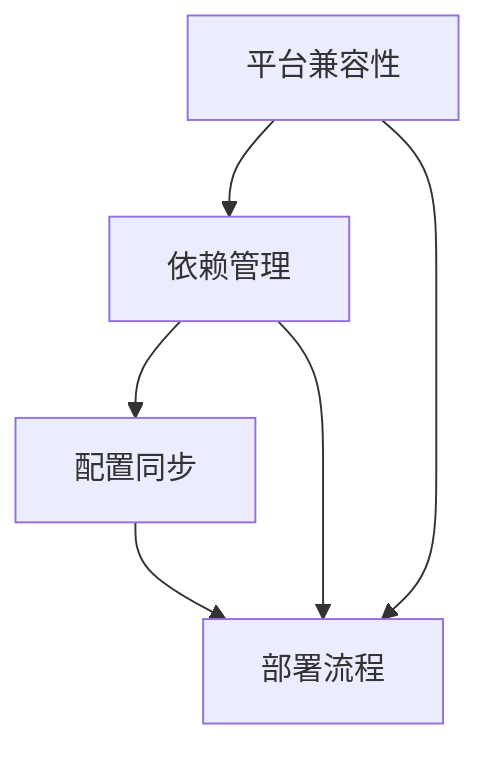
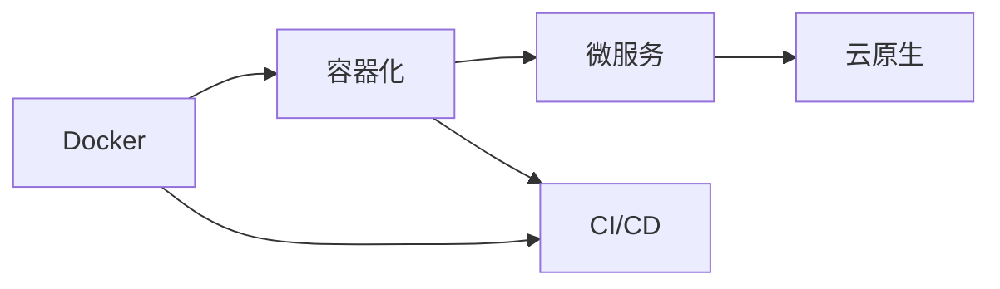

# 2024-03-12 技术学习日志：Docker容器化部署实践

## 【核心问题梳理】

### 1. 核心问题清单
- **平台兼容性问题**：Docker在M1/M2 Mac上的ARM64架构适配
- **依赖管理挑战**：Python应用的跨平台依赖处理
- **配置同步问题**：开发环境与生产环境的配置一致性
- **部署流程优化**：容器化部署最佳实践的建立

### 2. 问题关联性分析
这些问题形成了一个完整的技术链条：


> 关键发现：平台兼容性问题是其他问题的基础，正确处理平台问题才能确保后续步骤的顺利进行。

## 【知识点拓展】

### 1. 容器技术生态
- **Docker发展历程**
  - 2013：Docker首次发布
  - 2015：Docker Compose推出
  - 2017：Moby Project启动
  - 2020：Docker Desktop for Apple Silicon预览
  
- **现代容器技术栈**
  - 容器运行时：Docker, containerd
  - 编排平台：Kubernetes, Docker Swarm
  - 镜像仓库：Docker Hub, Harbor
  - 构建工具：Dockerfile, Buildah

### 2. Python依赖管理演进
- **传统方案**：
  - requirements.txt
  - setup.py
- **现代工具**：
  - Poetry
  - Pipenv
  - PDM

> "依赖管理的复杂性往往被低估，它是构建可靠生产系统的关键因素。"

### 3. 跨平台部署趋势
- **ARM架构崛起**
  - Apple Silicon影响
  - 服务器端ARM应用
  - 性能与效率平衡

## 【技术深度解析】

### 1. Docker平台兼容性原理
```dockerfile
# 平台声明的重要性
FROM --platform=linux/arm64 python:3.10
```

**关键概念解析**：
- `--platform`标志通知Docker构建系统目标架构
- 多架构镜像（multi-arch images）原理
- 镜像构建过程中的架构适配

### 2. Python依赖管理最佳实践
```python
# 依赖分层示例
requirements/
    base.txt      # 基础依赖
    production.txt # 生产环境依赖
    development.txt # 开发环境依赖
```

**实践建议**：
- 使用虚拟环境隔离
- 明确版本锁定
- 依赖分层管理
- 使用依赖哈希校验

### 3. 容器化部署优化
**多阶段构建示例**：
```dockerfile
# 构建阶段
FROM python:3.10 AS builder
WORKDIR /build
COPY requirements.txt .
RUN pip wheel --no-cache-dir --no-deps -r requirements.txt

# 运行阶段
FROM python:3.10-slim
COPY --from=builder /build /wheels
RUN pip install /wheels/*
```

## 【知识图谱构建】

### 1. 技术栈关联


### 2. 学习路径建议

#### 基础阶段
1. **容器基础**
   - Docker基本概念
   - Dockerfile编写
   - 容器生命周期管理

2. **Python应用容器化**
   - 依赖管理
   - 环境配置
   - 开发工作流

#### 进阶阶段
1. **最佳实践**
   - 多阶段构建
   - 镜像优化
   - 安全加固

2. **生产部署**
   - 监控方案
   - 日志管理
   - 性能优化

### 3. 技术选型建议

#### 开发环境
- **IDE**: VS Code + Docker插件
- **依赖管理**: Poetry/Pipenv
- **调试工具**: Docker Desktop

#### 生产环境
- **容器编排**: Kubernetes/Docker Swarm
- **监控方案**: Prometheus + Grafana
- **日志管理**: ELK Stack

## 【实践总结】

### 1. 关键经验
> "在Docker环境中，配置的一致性和可重复性比开发的便利性更重要。"

### 2. 常见陷阱
- 忽视平台兼容性问题
- 依赖管理不当
- 配置分离不充分
- 镜像优化不足

### 3. 改进建议
1. **工具链优化**
   - 使用Docker Compose管理服务
   - 引入构建缓存机制
   - 实施自动化测试

2. **流程标准化**
   - 建立构建规范
   - 完善文档体系
   - 优化部署流程

## 【进阶学习方向】

1. **容器编排**
   - Kubernetes基础
   - 服务网格
   - 云原生架构

2. **DevOps实践**
   - CI/CD流程
   - 自动化测试
   - 监控告警

3. **性能优化**
   - 镜像精简
   - 启动优化
   - 资源利用

4. **安全加固**
   - 漏洞扫描
   - 最小权限
   - 安全基线

> "技术学习是一个循环往复的过程，每解决一个问题都会开启新的学习领域。"
