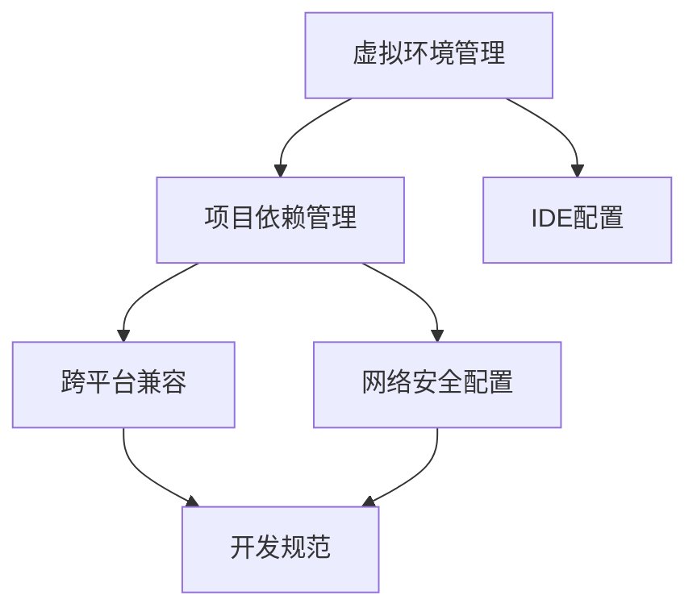

# 技术学习日志：Python 虚拟环境与开发环境配置 📝

## 2024-11-22 技术学习日志

<div align="center">
  
  
  
  
</div>

## 【核心问题梳理】 🎯

### 主要问题脉络 🔍

今天的技术探索主要围绕 **Python 虚拟环境配置**展开，形成了一个从创建到问题处理的完整链路：

1. **虚拟环境管理** 🌱
   - 问题：如何在 VSCode 中创建和管理 Python 虚拟环境？
   - 解决：使用 `python3 -m venv` 命令创建，通过 `source .venv/bin/activate` 激活
   - 关联：与 IDE 集成和项目依赖管理紧密相连

2. **多环境共存问题** 🔄
   - 问题：VSCode 中显示多个虚拟环境如何处理？
   - 解决：清理冗余环境，维护单一虚拟环境
   - 关联：涉及开发环境标准化和项目配置管理

3. **跨平台兼容性** 💻
   - 问题：Windows 专用包在 Mac 环境下的处理
   - 解决：移除平台特定依赖，调整 requirements.txt
   - 关联：与 Python 包管理和跨平台开发实践相关

4. **网络与安全问题** 🔒
   - 问题：SSL 证书验证失败
   - 解决：使用镜像源和信任主机配置
   - 关联：涉及 Python 包管理安全性和网络配置

### 问题关联性分析

这些问题形成了一个相互关联的技术生态：


## 【知识点拓展】 📚

### Python 虚拟环境技术生态 🌐

1. **历史发展** 📅
   - Python 早期：全局环境管理
   - virtualenv 的出现：独立环境概念引入
   - venv 模块：Python 3.3+ 内置虚拟环境支持
   - 现代工具：Poetry, Pipenv 等新一代包管理工具

2. **最新技术趋势** 🚀
   - 容器化虚拟环境管理
   - 依赖解析算法优化
   - 开发环境标准化
   - IDE 集成增强

3. **应用场景分析** 🔍
   - 项目隔离开发
   - 依赖版本管理
   - 部署环境一致性
   - 团队协作标准化

## 【技术深度解析】 🔬

### 1. 虚拟环境原理剖析

虚拟环境本质是创建独立的 Python 解释器环境，通过修改系统路径实现包隔离：

```python
# 虚拟环境激活脚本核心逻辑
import os
import site

# 修改 sys.path
base = os.path.dirname(os.path.dirname(os.path.abspath(__file__)))
os.environ["VIRTUAL_ENV"] = base

# 修改 PATH 环境变量
bin_dir = os.path.join(base, "bin")
os.environ["PATH"] = bin_dir + os.pathsep + os.environ["PATH"]
```

### 2. 最佳实践指南

1. **虚拟环境管理**
   ```bash
   # 创建虚拟环境
   python3 -m venv .venv
   
   # 激活环境
   source .venv/bin/activate
   
   # 依赖管理
   pip install -r requirements.txt
   ```

2. **依赖文件管理**
   ```txt
   # requirements.txt 最佳实践
   package_name==version  # 固定版本
   package_name>=version  # 最小版本要求
   package_name~=version  # 兼容性版本
   ```

### 3. 常见问题解决方案

1. **SSL 证书问题**
   ```bash
   # 使用镜像源
   pip install -r requirements.txt -i https://pypi.tuna.tsinghua.edu.cn/simple
   
   # 信任配置
   --trusted-host pypi.tuna.tsinghua.edu.cn
   ```

2. **跨平台兼容**
   ```python
   # 条件依赖示例
   requirements = [
       'base_package',
       'pywin32==308; platform_system=="Windows"'
   ]
   ```

## 【知识图谱构建】 🗺️

### 技术栈关联 🔗

1. **核心技术栈** ⚡
   - Python 解释器
   - 包管理工具（pip）
   - 虚拟环境（venv）
   - IDE 集成（VSCode）

2. **扩展技术栈** 🛠️
   - 容器技术（Docker）
   - CI/CD 工具
   - 代码质量工具
   - 依赖检查工具

### 学习路径建议 📈

1. **基础阶段** 🌱
   - Python 基础语法
   - 包管理基础
   - 虚拟环境概念

2. **进阶阶段** 🚀
   - 依赖管理最佳实践
   - 开发环境配置
   - 跨平台开发注意事项

3. **高级阶段** 🎓
   - 自动化环境配置
   - 容器化开发环境
   - 团队最佳实践制定

### 进阶方向 🎯

1. **工程化方向** ⚙️
   - 自动化环境配置
   - 开发环境标准化
   - CI/CD 集成

2. **架构方向** 🏗️
   - 微服务架构
   - 容器化部署
   - 云原生开发

3. **工具链方向** 🛠️
   - 自动化工具开发
   - IDE 插件开发
   - 开发效率工具

## 【经验总结】 💡

通过这次实践，我们深入理解了 Python 虚拟环境的重要性和复杂性。关键经验包括：

1. **环境隔离的重要性** 🔒
   > 虚拟环境不仅是一个开发工具，更是项目管理的重要基础设施

2. **标准化的必要性** 📋
   > 制定并遵循标准的环境配置流程，可以大幅减少团队协作成本

3. **问题解决思路** 🔍
   > 遇到问题时，从环境、依赖、平台兼容性等多个角度系统分析

## 【后续规划】 🎯

1. **技术提升** 📚
   - 深入学习 Python 包管理机制
   - 研究自动化环境配置方案
   - 探索容器化开发环境

2. **工程实践** ⚙️
   - 建立团队开发环境标准
   - 完善依赖管理流程
   - 优化开发工具链

3. **知识分享** 📢
   - 编写环境配置指南
   - 整理常见问题解决方案
   - 分享最佳实践经验

