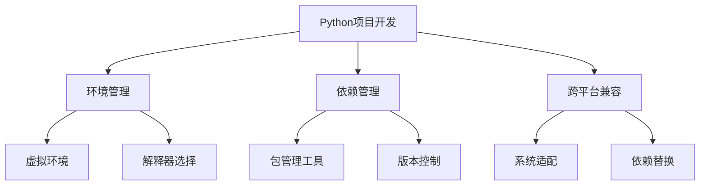

#  技术学习日志 📝

## 2024-11-25 技术学习日志

<div align="center">
  
  
  
  
</div>

## 【核心问题梳理】 🎯

### 1. Python 跨平台开发适配问题 🔄
**问题描述** ⚠️：在 Mac 系统上部署 Windows 开发的 Python 项目（langchain-chatchat）时遇到的系统兼容性问题
**核心解答** 💡：
- 识别并移除 Windows 特定依赖（如 `pywin32`）📦
- 创建平台特定的依赖文件（requirements_mac.txt）📄
- 使用跨平台兼容的依赖替代方案 🔄

> 跨平台开发的关键在于识别系统特定的依赖，并找到合适的替代方案或优雅的降级策略。 💭

### 2. SSL 证书验证问题 🔒
**问题描述** ⚠️：在包安装过程中遇到的 SSL 证书验证失败问题
**核心解答** 💡：
- 更新证书库（certifi）🔑
- 使用可信任的镜像源 🌐
- 配置信任主机选项 ⚙️

> SSL 证书问题常见于网络受限或证书配置不当的环境，需要在安全性和可用性之间找到平衡。 ⚖️

### 3. Python 包管理与依赖解决 📦
**问题描述** ⚠️：项目依赖安装与版本兼容性问题
**核心解答** 💡：
- 使用虚拟环境隔离依赖 🌱
- 采用国内镜像源加速下载 🚀
- 处理依赖冲突和版本约束 🔧

## 【知识点拓展】 📚

### Python 生态系统 🌐
1. **包管理工具演进** 📈
   - pip 的发展历程 🔄
   - 现代包管理工具（poetry, pipenv）🛠️
   - 虚拟环境工具（venv, virtualenv）🌱

2. **跨平台开发最佳实践** ✨
   - 系统特定代码处理策略 💻
   - 条件导入和平台检测 🔍
   - 依赖管理的平台差异 ⚖️

3. **安全性考虑** 🛡️
   - SSL/TLS 在 Python 中的应用 🔒
   - 证书验证机制 ✅
   - 安全的依赖管理 🔐

## 【技术深度解析】 🔬

### Python 虚拟环境原理 🧪
```python
# 虚拟环境创建过程 🌱
python -m venv .venv
source .venv/bin/activate  # Unix
.venv\Scripts\activate.bat # Windows
```

虚拟环境通过创建独立的 Python 解释器副本和包目录，实现项目级别的依赖隔离。这种隔离机制确保了：
- 不同项目使用不同版本的包 📦
- 避免全局包污染 🛡️
- 便于项目迁移和部署 🚀

### 依赖管理最佳实践 ⚙️
1. **明确依赖说明** 📋
```python
# requirements.txt 最佳实践 📝
package_name==specific_version  # 精确版本
package_name>=minimum_version  # 最小版本要求
package_name>=min,<max  # 版本范围
```

2. **依赖解析策略** 🎯
- 使用 `pip-tools` 生成确定性依赖 🛠️
- 采用分层依赖文件组织 📑
- 实现可重现的构建环境 ��

## 【知识图谱构建】 🗺️

### 核心技术关联 🔗


### 学习路径建议 📈
1. **基础阶段** 🌱
   - Python 基础语法 📖
   - 包管理基本概念 📦
   - 虚拟环境使用 🔧

2. **进阶阶段** 🚀
   - 依赖管理工具深入 🛠️
   - 跨平台开发技巧 💻
   - 安全性最佳实践 🔒

3. **专家阶段** 🎓
   - 构建工具开发 ⚙️
   - CI/CD 集成 🔄
   - 大规模项目管理 📊

### 深入学习建议 📚
- 研究 Python 打包规范（PEP）📋
- 了解不同操作系统的特性 💻
- 掌握自动化构建工具 🛠️
- 学习容器化技术 🐳

## 【实践要点】 💡

1. **环境配置清单** ⚙️
```bash
# 基础环境设置 🌱
python -m venv .venv
source .venv/bin/activate
pip install --upgrade pip setuptools wheel

# 依赖安装 📦
pip install -r requirements.txt --trusted-host pypi.org --trusted-host files.pythonhosted.org -i https://pypi.tuna.tsinghua.edu.cn/simple
```

2. **问题排查流程** 🔍
- 检查环境变量 ⚙️
- 验证 Python 版本 🐍
- 确认系统依赖 📦
- 检查网络连接 🌐
- 分析错误日志 📋

3. **维护建议** 🛠️
- 定期更新依赖 🔄
- 保持文档同步 📚
- 进行兼容性测试 ✅
- 监控安全警告 ⚠️

## 【技术趋势与展望】 🔮

1. **包管理工具发展** 📈
- 更智能的依赖解析 🧠
- 更好的跨平台支持 🌐
- 集成安全审计功能 🛡️

2. **开发工具链演进** ⚡
- 自动化依赖更新 🔄
- 智能化问题诊断 🔍
- 跨平台开发辅助 💻

3. **最佳实践趋势** 🎯
- "零配置"工具链 ⚙️
- 更严格的依赖锁定 🔒
- 更完善的安全机制 🛡️

## 【总结与反思】 📝

今天的技术实践涉及 Python 项目的跨平台迁移和环境配置，主要解决了系统兼容性、证书验证和依赖管理等问题。这些问题反映了现代软件开发中常见的挑战，需要在技术选型和实现方案上进行权衡。

通过这次实践，我们不仅解决了具体问题，还深入理解了 Python 生态系统的多个重要概念。这些经验对于构建可靠、可维护的 Python 项目具有重要参考价值。 ✨